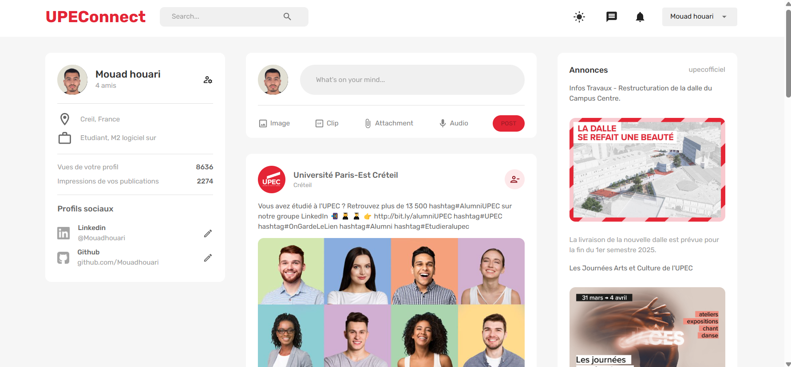
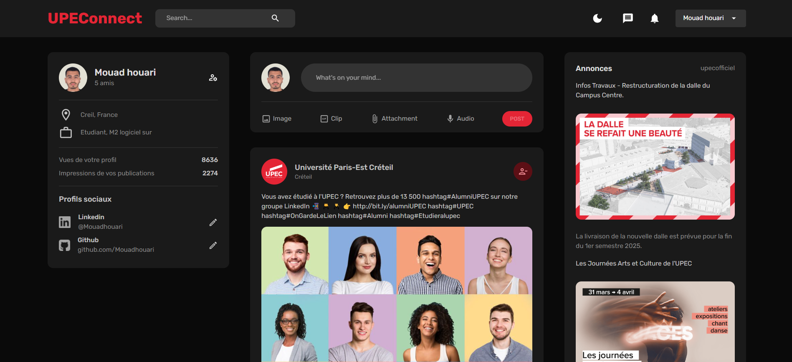
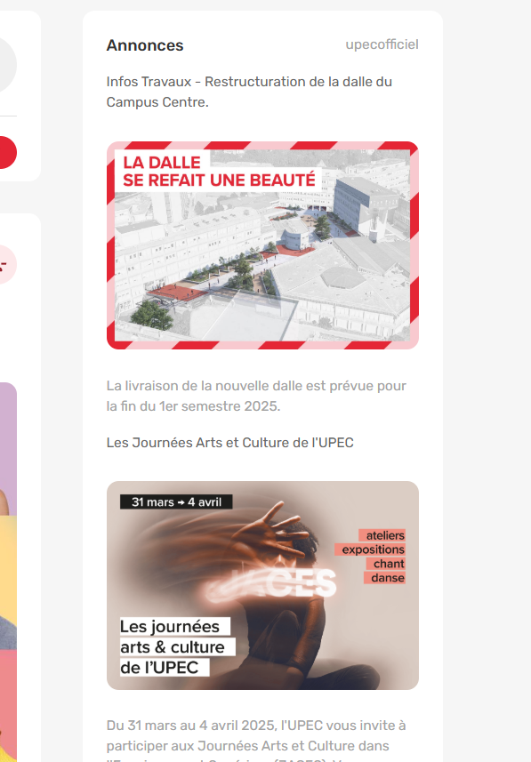
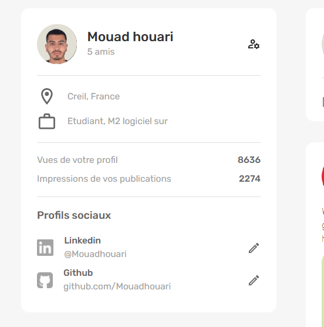
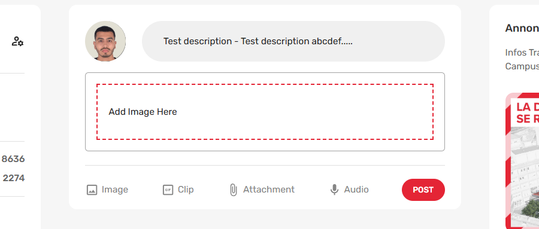
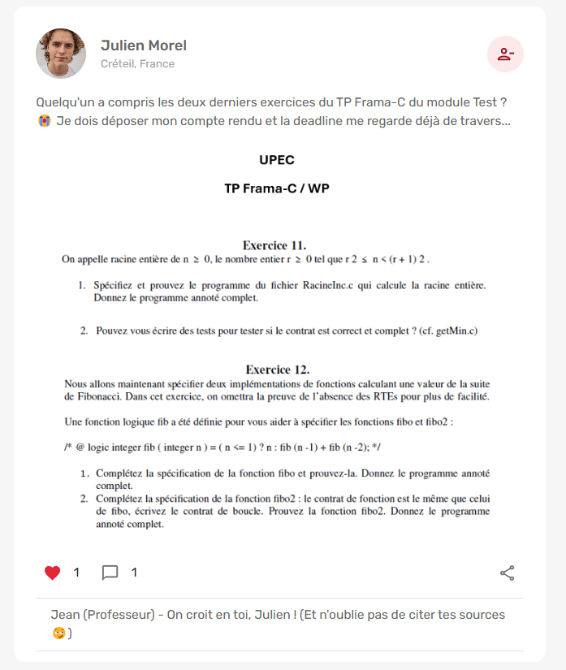
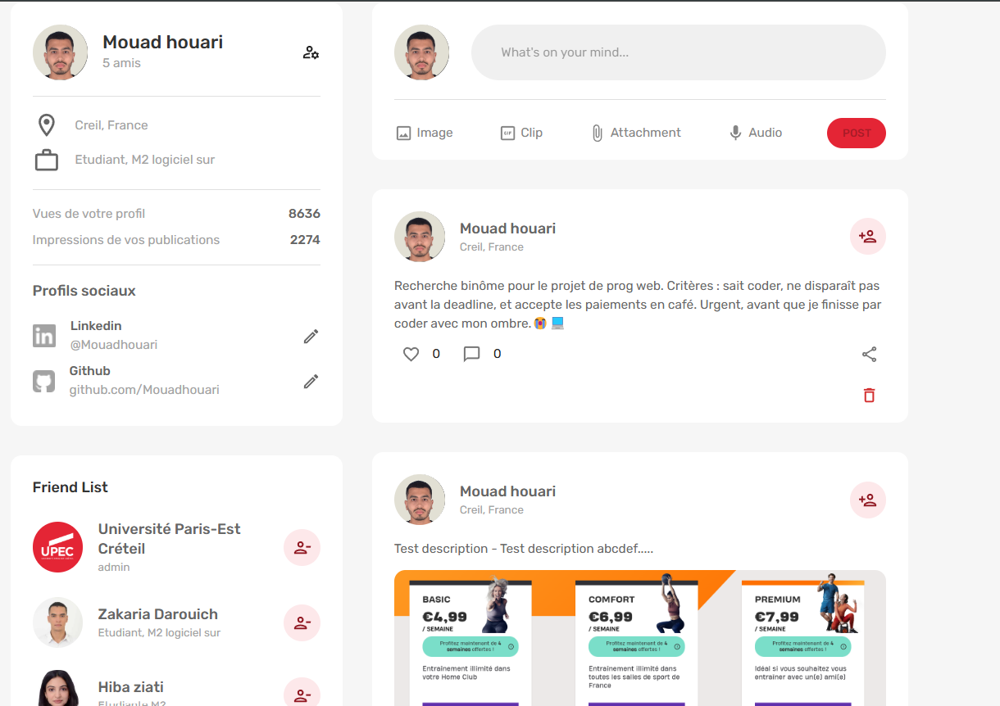
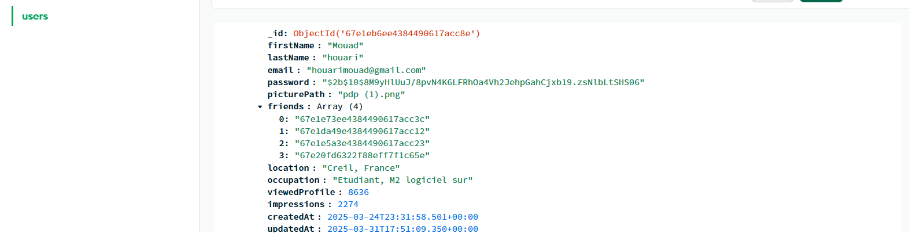
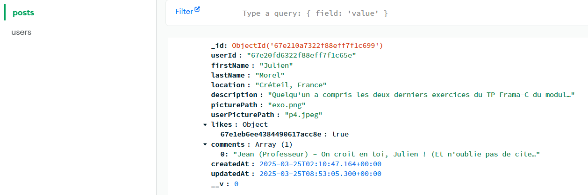

# 🎓 UPEConnect - Projet 

**Plateforme de réseau social expérimental** exclusive aux étudiants et enseignants de l'Université Paris-Est Créteil (**UPEC + Connect**).

> ⚠️ **Note importante** : Ce projet a été réalisé **uniquement à des fins d'apprentissage**. Il s'agit d'une démonstration technique et non d'un produit officiel de l'UPEC.

---

## 📌 Objectifs
- ✅ Pratiquer le développement Full-Stack (MERN)
- ✅ Implémenter une architecture REST
- ✅ Gérer l'authentification sécurisée
- ✅ Manipuler des bases de données NoSQL

---

## 🛠 Stack Technique

### Frontend
-  **React.js**  
  - Hooks (*useState, useEffect, useContext*)  
  - React Router v6
-  **Redux Toolkit**  
  - Gestion d'état global
-  **Material-UI**  
  - Thème personnalisé

### Backend
-  **Node.js +**   **Express.js**  

  - API REST
-  **MongoDB**  
  - Base de données NoSQL
-  **Mongoose**  
  - Modélisation des données
-  **JWT**  
  - Authentification sécurisée

---

## ✨ Fonctionnalités Implémentées

### 📢 Fil d'Actualité

### 🌙 Mode Sombre

### 👥 Liste d'Amis & Annonces Officielles
| Friend List | Annonces Officielles |
|------------|----------------------|
|  |  |

### 🔍 Informations de Profil & Ajout de Post
| Informations de Profil | Ajouter un Post |
|-----------------------|----------------|
|  |  |

### 📝 Exemple de Post avec Commentaires

### 🏠 Profil Personnel
*N'affiche que mes propres posts avec une option de suppression.*  

> *Toutes les données sont fictives et créées uniquement pour l'exercice.*

---

## 📊 Schémas MongoDB (Exemples)

### 🗂 Collection users

### 📝 Collection posts

---

🚀 **Projet réalisé dans le cadre d'une expérimentation technique et académique.**